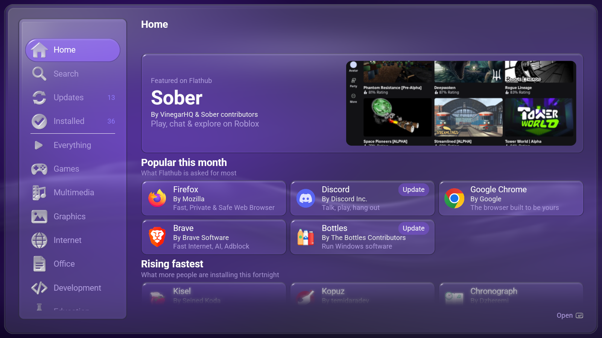
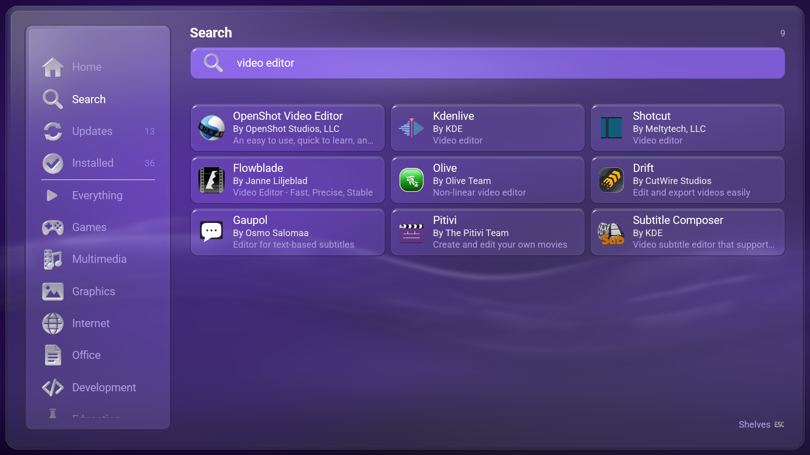
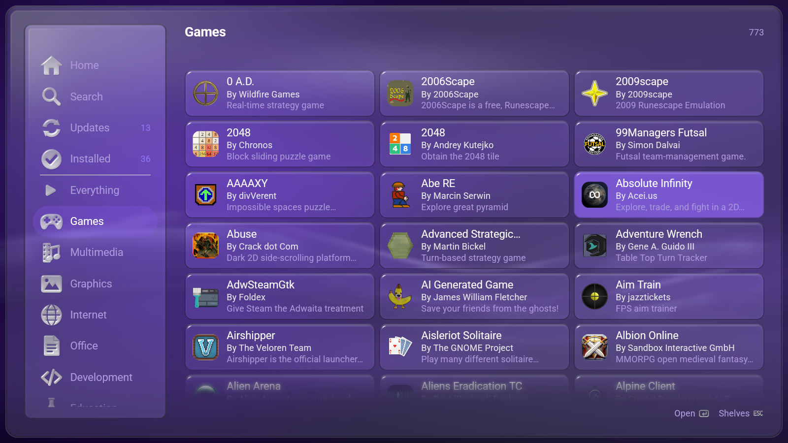
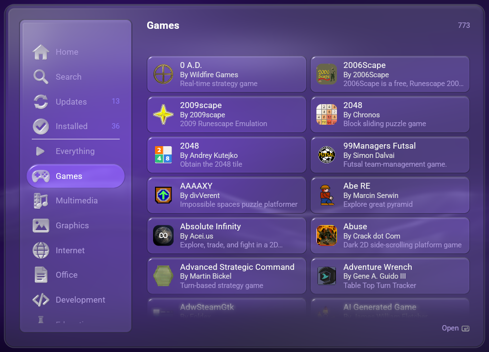
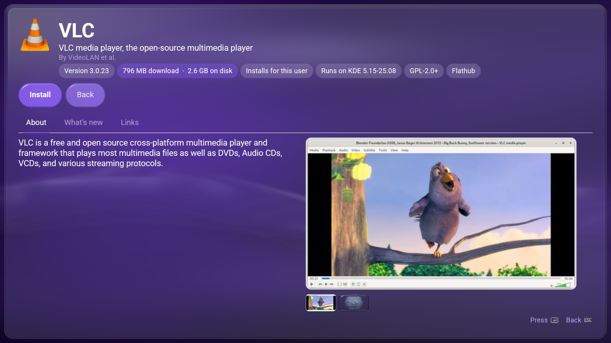
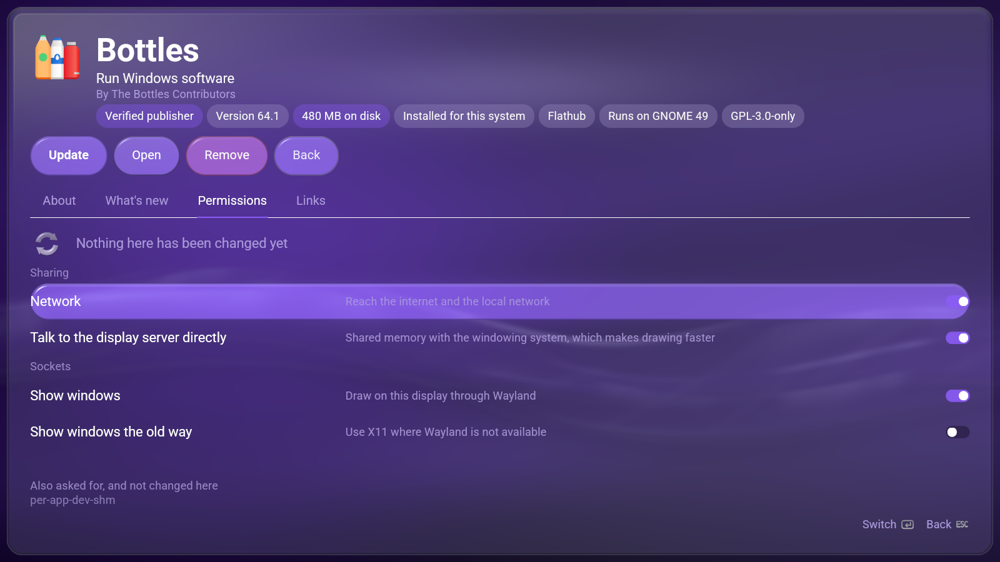
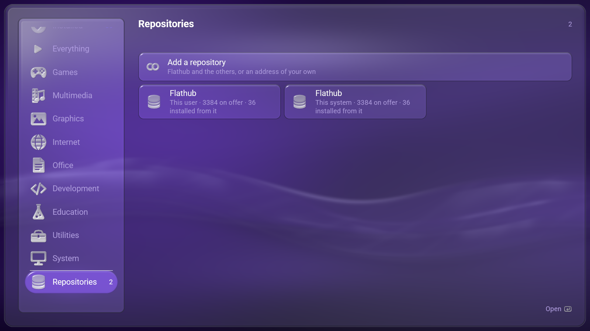

# DistriBumpy

**A Flatpak store that belongs in [LineXinBar](https://github.com/Petexy/LineXinBar).**

It appears as **Software Hub** — on the shell and in any other desktop's menu
— and it is an ordinary Wayland application built on
[`lxb-toolkit`](https://github.com/Petexy/lxb-toolkit): the shell's own colours,
glass, motion, type and marks, driven from a keyboard, a pointer and a
controller at once. The mouse wheel and a touchpad scroll whichever pane is
under the pointer, without first making somebody move focus into it.



## What it does

- **Opens on a Home page** with one featured application and its artwork, then
  what Flathub itself says is worth looking at: what is asked for most, what is
  rising fastest, what has just been published and what has just been rebuilt.
  Those four lists are facts about everybody else's machines and are the one
  thing here that cannot be read off this disk, so they are kept after they are
  fetched and the page comes up filled with no network. **Flathub publishes no
  ratings** — there is no score, no stars and no reviews in its API — so
  nothing here invents one.
- **Browses every repository flatpak knows about**, from the AppStream
  catalogue they already keep on the disk. Flathub's is 47 MB, and it is read
  as a stream on a thread of its own — which means a machine that has been
  updated once can be browsed with the network unplugged.
- **Shelves that match the shell's own.** Games, Multimedia, Graphics,
  Internet, Office, Development, Education & Science, Utilities, System — the
  XDG categories the shell sorts installed applications into, so something
  found here lands on the column it will appear in.
- **Searches by name and by summary.** Nothing is called "video editor", but
  Kdenlive's summary is exactly that, so a query of more than one word answers
  with what it means rather than with what is first in the alphabet. Opening
  the shelf stands the light **in the field**, which is what says a field has
  the cursor — and under LineXinBar that is what brings the on-screen keyboard
  up for it. Back leaves the field for the shelves.


- **Installs, updates and removes**, with progress operation by operation — a
  transaction installing one application routinely runs a dozen — and a **Stop**
  that keeps whatever has already been fetched. Removing an application or
  forgetting a repository first opens a confirmation with the safe answer
  selected.
- **Says what an install would really cost** before the press: the download and
  the disk, counting every runtime and extension this machine does not already
  have. That is the difference between 828 kB and 759 MB, and it can only be
  learnt by resolving the transaction and refusing it.
- **Updates everything**, and **clears out the runtimes nothing needs any
  more**, which is where a machine's flatpak disk usage actually goes.
- **Opens what is installed**, without going back to a menu for it.



The shelves stand in a panel of their own, at the height the design language
asks a row to be: the panel carries them rather than squeezing fifteen into
whatever room there is. **A list says it runs on by dissolving at its ends**:
over the last card and a bit, its cards and their words grow blurrier and more
translucent together until what is left is exactly the page behind them — so
the list stops without anything to stop at, while the heading, the shelves and
the footer stay sharp. Each end appears only where more really continues past
it, and narrows away to nothing at the end of the list. Everything on offer is
a card in a grid three across — as many as fit, down to one on a narrow
window.

What the buttons do is written in the corner opposite, drawn rather than
lettered: the same act is South on a pad and Enter on a keyboard, and there is
no wording that names both without naming neither. It says whichever the shell
last saw reached for.





An application's page carries publisher, verification, version, size, install
scope, runtime and licence as facts that wrap rather than disappear off a
narrow window. It also carries what changed in each release, everywhere else
to read about it, and its screenshots — each in a frame cut to the shape the
catalogue declares for it, so the frame is right before the picture has been
fetched and never changes shape underneath one landing in it.

### Permissions



What each application may reach outside its sandbox, and a switch for every one
of it that is worth switching. Anything it asked for that has no switch here is
still listed, so nothing it asked for is hidden.

Changes are written to **this user's own override**, in
`~/.local/share/flatpak/overrides/`, as differences rather than as a whole
permission set: `!network` takes something away that the application asked for,
and setting a permission back removes the entry entirely. That is what makes an
override safe to keep across an update that changes what the application asks
for — and it is why nothing here needs a password, even for an application
installed for the whole machine.

### Repositories



Every repository of both installations, switched off as readily as switched on.
Each one can be **switched off** without being forgotten, have its **catalogue
fetched** again, or be **forgotten** entirely — and Flathub, Flathub beta,
GNOME Nightly and KDE Nightly can be added with one press, or anything else by
the address of its `.flatpakrepo` file.

## Where things go

New applications are installed **for the current user** whenever that
repository is available there. Nothing then has to be authorised and nothing
outside `~/.local/share` changes. If an application is offered only by a
system repository, its page says so and the desktop asks for authorization
before installing it.

Anything already installed **for the whole system** — which is most of what is
on a typical machine — is listed, updated and removed just as readily. Those
raise the desktop's own password panel, and the page says so before the press
rather than after it.

## Building

```sh
cargo build --release
cargo test
```

It needs **lxb-toolkit 0.9.0 or newer**, installed rather than checked out:
`lxb-app` is a path dependency at `/usr/share/lxb-toolkit/crates`, so cargo
compiles the language into this binary and the finished program links no
`liblxb_*.so` at all. What each release since 0.3.0 was needed for is written
out in `Cargo.toml`, beside the requirement itself. DistriBumpy also needs
**flatpak** with its development files, which is what `libflatpak` links
against.

Four integration tests exercise Flatpak or its per-user override path and are
left out of the ordinary run. All leave the machine exactly as they found it:

```sh
cargo test -- --ignored --nocapture a_real_install       # install and remove
cargo test -- --ignored --nocapture a_repository_is_added  # add, switch, forget
cargo test -- --ignored --nocapture a_dry_run            # what an install would fetch
cargo test -- --ignored --test-threads 1 an_override_really  # write and read an isolated override
```

## Installing

```sh
cargo build --release
sudo bash packaging/install.sh --destdir / --prefix /usr
```

That places the binary, the desktop entry, the icon and the AppStream data, and
nothing else — every distribution package here calls the same script, so what
you get by hand is what a package would have given you.

Or build one:

```sh
./packaging/build.sh check     # the definitions and their payload
./packaging/build.sh arch      # makepkg
./packaging/build.sh debian    # dpkg-deb, on Debian or Ubuntu
./packaging/build.sh fedora    # rpmbuild, on Fedora
./packaging/build.sh nix       # the flake
```

See [packaging/README.md](packaging/README.md) — in particular for why the
toolkit is a *build* dependency and not a runtime one, and for the two
libraries that are opened by name at run time and so must be named by hand in
every package.

## Looking at a page without a screen

```sh
distribumpy --shot home.png --shelf 0
distribumpy --shot page.png --shelf 1 --query "video editor"
distribumpy --shot detail.png --app org.videolan.VLC --tab 2
distribumpy --shot repos.png --repo flathub
distribumpy --shot narrow.png --shelf 5 --width 1000 --height 720
```

Shelves count from Home at nought.

`--shot` draws a settled frame to a PNG with no display at all, through the
same page function and the same renderer the window uses, reading the machine
it is run on. Every animation is put where it is going first, so what it
photographs is the page at rest. It is how the pictures in this README were
taken.

`--after SECONDS` photographs a page on its way out of the card that opened
it instead: it settles the listing, presses the row the light is on, and
counts that many seconds. `--back` presses Back rather than a card, so the way
out can be photographed too. Both want `--row`, not `--app` — a page has to be
opened by a real press to have a card to grow out of.

```sh
distribumpy --shot opening.png --shelf 0 --row 2 --after 0.15
distribumpy --shot closing.png --shelf 0 --row 2 --after 0.15 --back
```

## How it is put together

| | |
|---|---|
| `src/catalogue.rs` | The AppStream catalogue: a streaming parse, the shelves, and the search |
| `src/flatpak.rs` | libflatpak: the installations, the repositories, and the transaction worker |
| `src/flathub.rs` | The four lists behind the Home page, which are the only thing not on this disk |
| `src/sandbox.rs` | What an application may reach, and this user's overrides |
| `src/art.rs` | Screenshots — the one part of a listing not already on this disk |
| `src/motion.rs` | Everything on a page that is on its way somewhere |
| `src/store.rs` | What is on the screen and what the controls do to it |
| `src/draw.rs` | The shelves, the listing, and what runs along the bottom |
| `src/detail.rs` | The pages that are about one thing |
| `src/legend.rs` | What the buttons do, and which control the user has in hand |

Five threads, and only one of them draws: the frame loop, a catalogue reader, a
transaction worker, a fetcher for screenshots, and one for Flathub's own lists. **libflatpak's objects are
GObjects and are not `Send`** — nothing is handed between threads but a plain
description of a job and a plain report of how it went.

## Licence

[GPL-3.0-only](LICENSE), matching LineXinBar and the toolkit.
