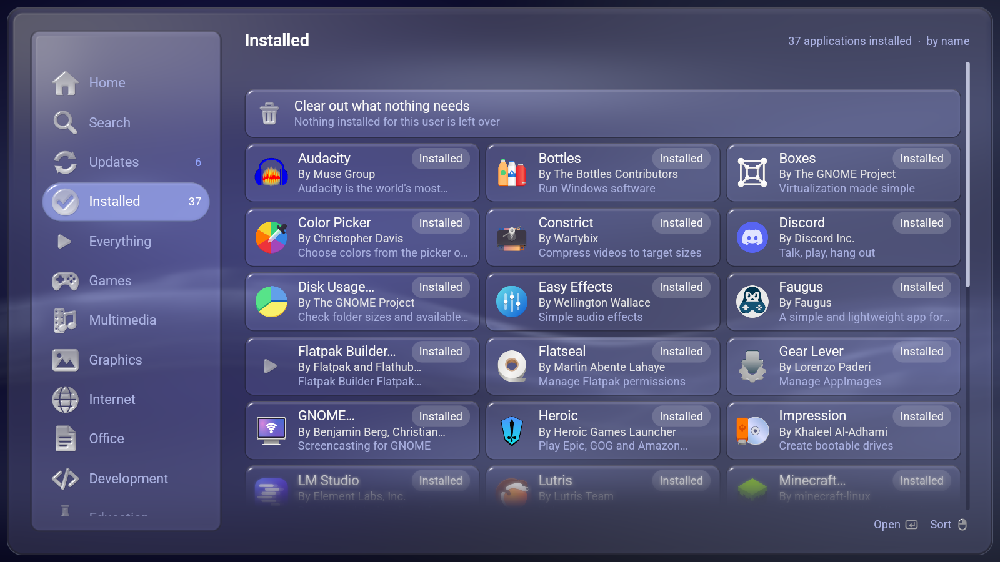

# How DistriBumpy is built, and why

This is the long answer. [The README](../README.md) is the short one.

## Five threads, and only one of them draws

The frame loop, a catalogue reader, a transaction worker, a fetcher for
screenshots, and one for Flathub's own lists.

**libflatpak's objects are GObjects and are not `Send`** — so nothing is handed
between threads but a plain description of a job and a plain report of how it
went. That is the constraint the whole shape of `flatpak.rs` comes out of: the
worker owns its installations and its transaction, and the frame loop owns a
picture of what the worker last said.

Flathub's catalogue is 47 MB of AppStream XML and is read as a *stream* rather
than parsed into a tree — a tree of it is hundreds of megabytes and several
seconds of not drawing.

## The shelves, and the light in the field

The shelves stand in a panel of their own, at the height the design language
asks a row to be: the panel carries them rather than squeezing fifteen into
whatever room there is.

Opening the search shelf stands the light **in the field**, which is what says
a field has the cursor — and under LineXinBar that is what brings the on-screen
keyboard up for it. Back leaves the field for the shelves. A store whose search
needed a second press to start typing would be a store nobody searches.

## A list that dissolves at its ends

Over the last card and a bit, its cards and their words grow blurrier and more
translucent *together* until what is left is exactly the page behind them — so
the list stops without anything to stop at, while the heading, the shelves and
the footer stay sharp. Each end appears only where more really continues past
it, and narrows away to nothing at the end of the list.

Blurring the cards without blurring their words, or fading them at different
rates, is what makes a dissolve read as two things happening rather than one.

## What an install really costs

The download and the disk, counting every runtime and extension this machine
does not already have — the difference between 828 kB and 759 MB. It can only
be learnt by resolving the transaction and then refusing it, which is why the
figure arrives a moment after the page does rather than with it.

## Screenshot frames are cut before the picture arrives

Each screenshot goes in a frame cut to the shape the catalogue declares for it,
so the frame is right before the picture has been fetched and never changes
shape underneath one landing in it. A grid that reflows as pictures arrive is
a grid nobody can press.

## Where the pictures come from

Unlike its three siblings this one has no `--demo`: it reads the machine it is
run on. A store that made up its catalogue would be a picture of the made-up
catalogue, and the four Flathub lists on the Home page are facts about
everybody else's machines that cannot be invented at all.

`--after SECONDS` photographs a page on its way *out of the card that opened
it*: it settles the listing, presses the row the light is on, and counts that
many seconds. `--back` presses Back rather than a card, so the way out can be
photographed too. Both want `--row`, not `--app` — a page has to be opened by a
real press to have a card to grow out of.

```sh
distribumpy --shot opening.png --shelf 0 --row 2 --after 0.15
distribumpy --shot closing.png --shelf 0 --row 2 --after 0.15 --back
```

The pictures in the README are taken at the **Indigo** accent, which is not any
particular machine's. The accent is the one setting a picture of the interface
cannot help stating, and shots taken on different days in different colours
would read as different programs. Regenerate them with a scratch settings file
rather than by changing anybody's desktop:

```sh
mkdir -p /tmp/lxb-shot/lxb
printf 'accent = "Indigo"\n' > /tmp/lxb-shot/lxb/shell.toml
export XDG_CONFIG_HOME=/tmp/lxb-shot

distribumpy --shot docs/home.png         --shelf 0 --width 1600 --height 900
distribumpy --shot docs/installed.png    --shelf 3 --width 1600 --height 900
distribumpy --shot docs/browse.png       --shelf 5 --width 1600 --height 900
distribumpy --shot docs/search.png       --shelf 1 --query "video editor" --width 1600 --height 900
distribumpy --shot docs/detail.png       --app org.videolan.VLC --tab 0 --width 1600 --height 900
distribumpy --shot docs/permissions.png  --app org.videolan.VLC --tab 2 --width 1600 --height 900
distribumpy --shot docs/repositories.png --repo flathub --width 1600 --height 900
distribumpy --shot docs/narrow.png       --shelf 5 --width 1000 --height 720
```

Shelves count from Home at nought, so what a number means moves when a shelf is
added — check a shot rather than trusting the number.




